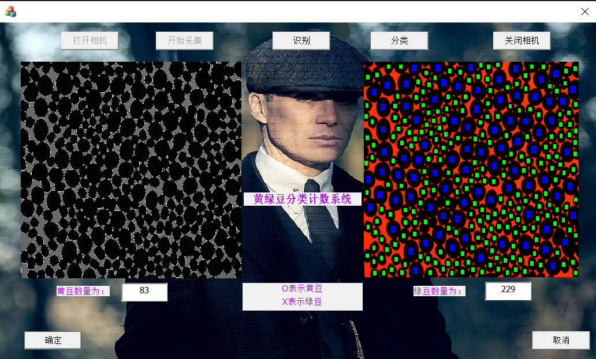

# Bean-Recognition
Final work for Pattern Recognition and Image Process Experiment, Getting A+ level and 96/100.
@HUST @AIA

Function: Classify and Count the number of the green bean and yellow bean.

Using traditional morphological algorithm including binary threshold, dilation & erosion, distance transform, and etc.

Using MFC for the user interface. 

Author: [Fanpeng Meng](https://github.com/mfp0610), [Tingbing Yan](https://github.com/Baron-sanmen)
